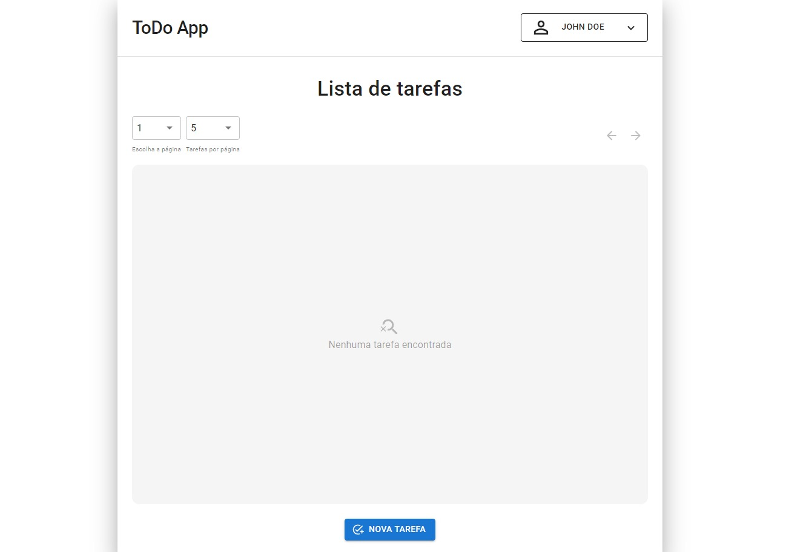
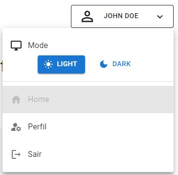
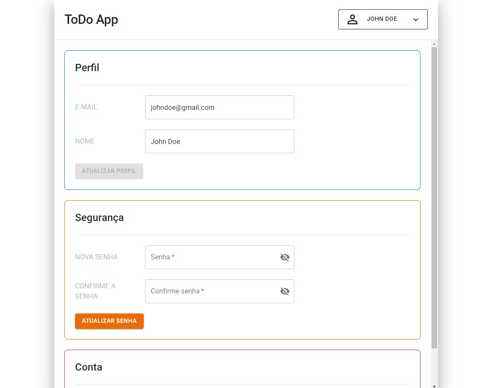
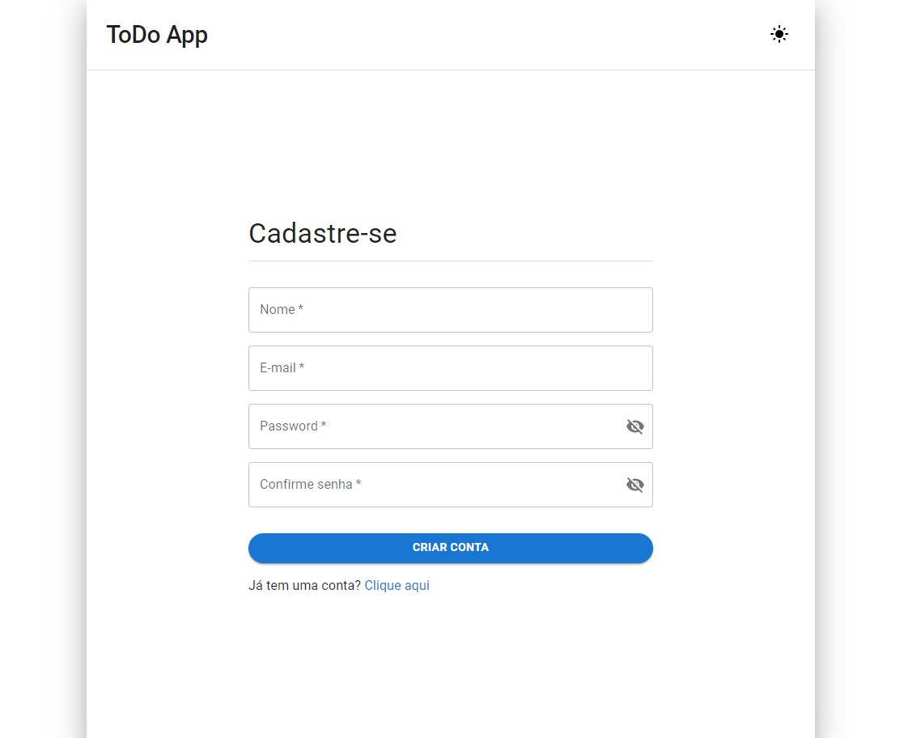
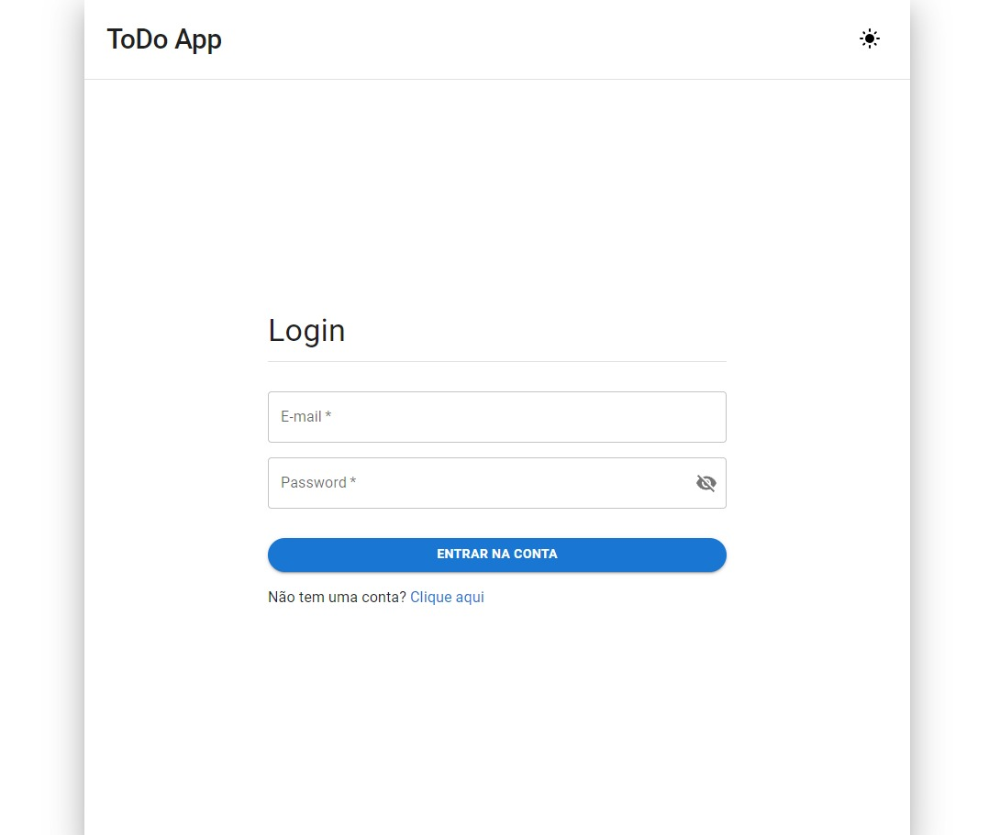

<div align="center">

# ToDo App

### Preview







</div>

## 💻 Technologies used

- 
- 
- 
- [](https://axios-http.com)
- [](https://reactrouter.com)
- [](https://www.typescriptlang.org)
- [](https://eslint.org)
- [](https://vitejs.dev)
- 

## GitHub Clone and Installation

```console
git clone https://github.com/Jean-Dresbach/ToDo_Front-end.git
```

After cloning the repository, install the dependencies using Yarn with the following command:

```console
yarn install
```

## 💡 Features

### Tasks:

- Add new task.
- Edit existing task.
- Delete task.
- View all of a user's tasks.

### Users:

- Add a new user (registration).
- Edit existing user.
- Delete user account.
- View all user information.

### Session

- Create session (login).
- Log out.

## 🚀 Running the Application

To run the application, you need to install and start the [ToDo_Back-end](https://github.com/Jean-Dresbach/ToDo_Back-end) API on your machine. Make sure you follow the installation and initialization instructions provided in the backend repository before proceeding to launch the application.

This will ensure that the frontend application has access to the features and functionality it needs to work properly. Once you've set up the backend, you're ready to launch the frontend application and start exploring all its features!

👾 Developed by [Jean Rafael Dresbach](https://www.linkedin.com/in/jean-rafael-dresbach/).
